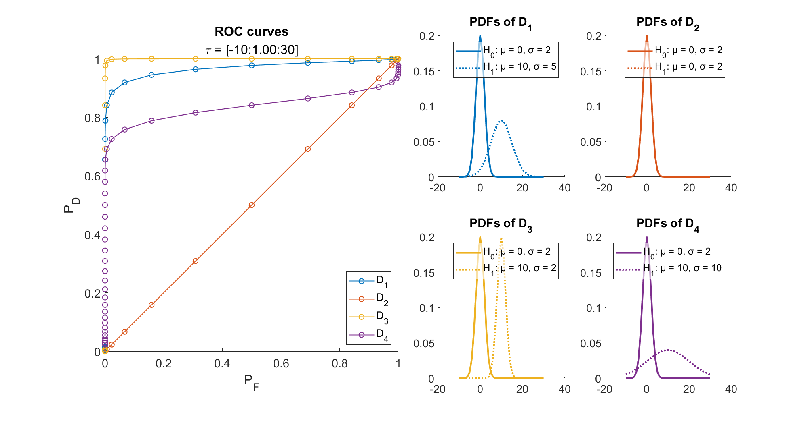

# Detection
Scripts for visualization of detection related concepts.

### roc_curve.m
A script to visualize the influence of (Gaussian) hypothesis PDFs on the resulting receiver operating characteristic (ROC) curve.

