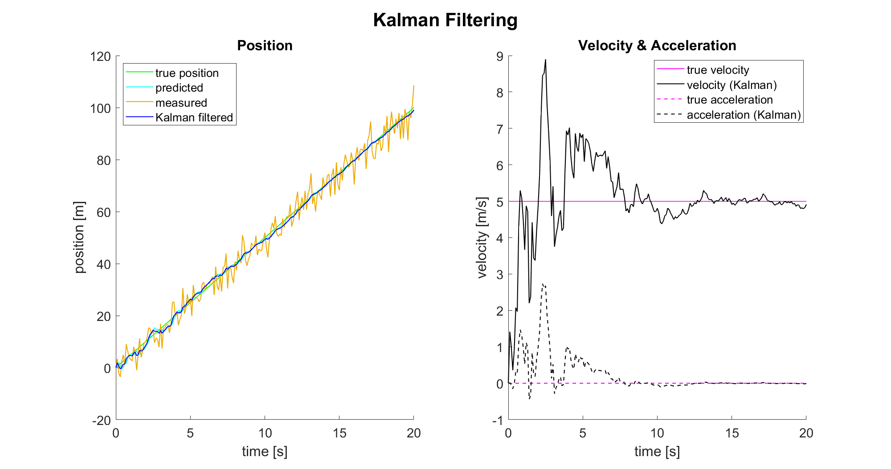

# Kalman Filter
Scripts implementing and applying the Kalman Filter. An example for the estimation of a car's position is included.

### kalman_filter.m
Kalman filtering of a car's position with constant velocity $v = 5 \frac{m}{s}$. The position measurements $y$ are taken every $\Delta t = 0.1s$ and are corrupted
by Gaussian noise ( $y_{noise} \ \mathtt{\sim}\  \mathcal{N}(0,20)$ ). The kinematic model is assumed to be perfect, i.e. **no process noise**.

The initial known state $\hat{x}_0$ deviates from the true initial state $x_0$ in its velocity:

$$\begin{equation*}
    \hat{x}_0 = \begin{bmatrix}
           0 \\
           1.25 \\
           0
         \end{bmatrix}, \qquad \qquad 
    x_0 = \begin{bmatrix}
           0 \\
           5 \\
           0
         \end{bmatrix}
\end{equation*}$$

The state-transition and measurement arrangement can be described as:

$$\begin{equation*}
    x_{t} = M_t x_{t-1} + \omega_t, \qquad \qquad 
    x_t = \begin{bmatrix}
           p_t \\
           v_t \\
           a_t
         \end{bmatrix}
\end{equation*}$$

and

$$\begin{equation*}
    y_{t} = K_t x_{t} + \epsilon_t, \qquad \qquad
\end{equation*}$$

---
