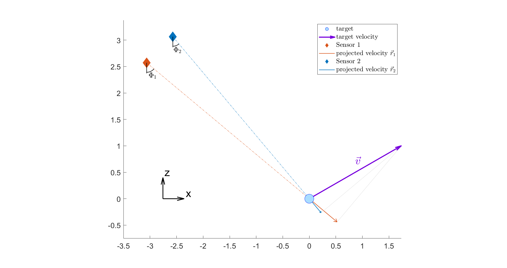
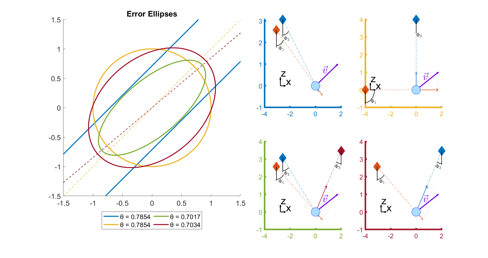

# Parameter Estimation
Scripts and examples regarding Parameter Estimation problems.

### error_ellipse.m
The velocity of a moving target is measured by radar sensors, which are only capable of measuring the velocity
component in the viewing direction.

The velocity $\mathbf{v}$, the measurements $\mathbf{r}$ and the measurement matrix $\mathbf{K}$ are defined as:

$$\begin{equation*}
    v = \begin{bmatrix}
           v_x \\
           v_z
         \end{bmatrix}, \qquad \qquad 
    r = \begin{bmatrix}
           r_1 \\
           \vdots \\
           r_i
         \end{bmatrix}, \qquad \qquad 
    K = \begin{bmatrix}
           sin(\Phi_1)  & -cos(\Phi_1) \\
           \vdots & \vdots \\
           sin(\Phi_i)  & -cos(\Phi_i)
         \end{bmatrix}
\end{equation*}$$

Assuming white noise and no prior knowledge, i.e.

$$\begin{equation*}
    C_{\epsilon \epsilon} = \mathbf{I}, \qquad \qquad 
    C_{xx} = \mathbf{0}
\end{equation*}$$

the MAP estimate and its error covariance matrix are given as

$$\begin{equation*}
    \hat{v} = (\mathbf{K}^T \mathbf{K})^{-1}\mathbf{K}^T\mathbf{r}, \qquad \qquad 
    \mathbf{C}_{\hat{v}\hat{v}} = (\mathbf{K}^T \mathbf{K})^{-1}
\end{equation*}$$

---
The script `error_ellipse.m` allows to define multiple experiments with different measurement arrangements in order
to compare the resulting error ellipses.

